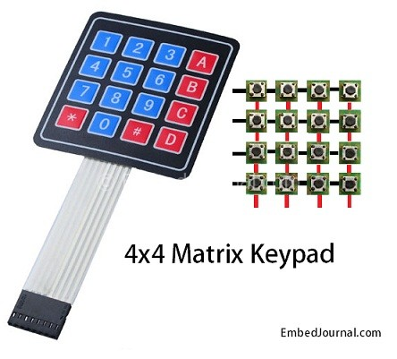
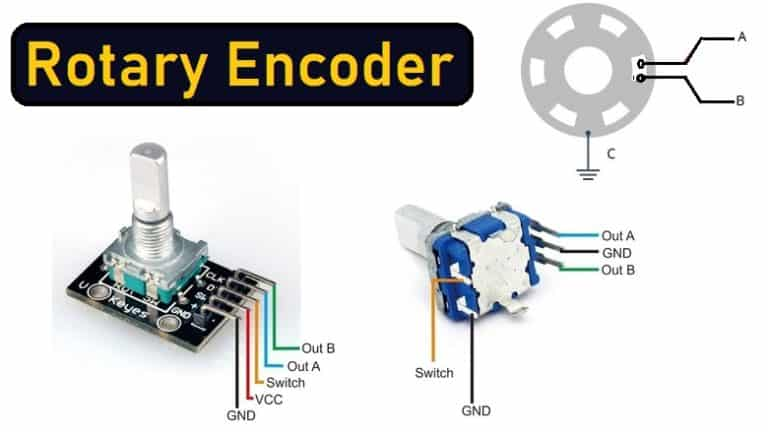

# BFM
This visionary plan embraces creativity, innovation, and the unexpected, transforming chaos into a driving force for success.

# Arduino Sensor types and Applications

| Name | Info_PINOUT  | Image |
| --- |  --- | :---: |
| [4x4 Matrix Keypad](https://embedjournal.com/interface-4x4-matrix-keypad-with-microcontroller/) |  <table border="0"><tr><td>[1]  <------>  [ard_pin_9]</td></tr><tr><td>[2]  <------>  [ard_pin_8]</td></tr><tr><td>[3]  <------>  [ard_pin_7]</td></tr><tr><td>[4]  <------>  [ard_pin_6]</td></tr><tr><td>[5]  <------>  [ard_pin_2]</td></tr><tr><td>[6]  <------>  [ard_pin_3]</td></tr><tr><td>[7]  <------>  [ard_pin_4]</td></tr><tr><td>[8]  <------>  [ard_pin_5]</td></tr></table>  |  |
| [Rotary_Encoder](https://howtomechatronics.com/tutorials/arduino/rotary-encoder-works-use-arduino/) |  <table border="0"><tr><td>[1_GND]           <------>  [ard_GND]</td></tr><tr><td>[2_VCC]           <------>  [ard_5V]</td></tr><tr><td>[3_Button_pin]    <------>  [---]</td></tr><tr><td>[4_DT][OUTPUT_B]  <------>  [ard_pin_6]</td></tr><tr><td>[5_CLK][OUTPUT_A] <------>  [ard_pin_7]</td></tr></table>  |  |

 
 

